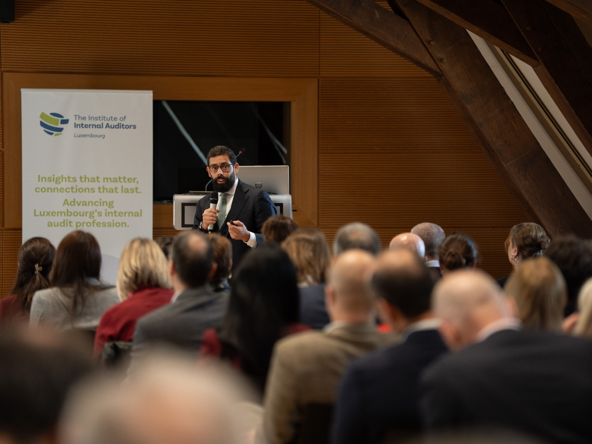
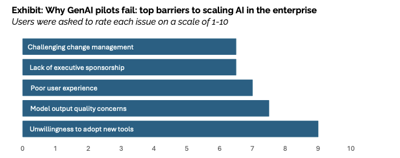
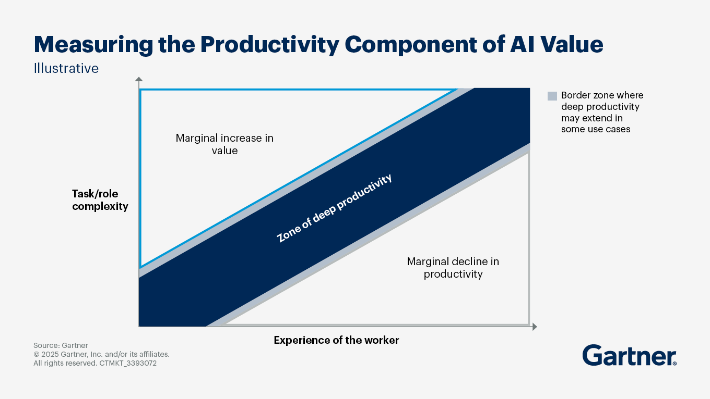

## Chronicles from a wonderful day in Luxembourg

I’m a bit tired of writing the usual gushing posts about how *amazing and empowering* it was to be part of event X, Y, or Z. Instead, here’s a short, candid note on what I actually took home after sharing my pitch — **“Bringing Internal Audit into the AI Age”** — with a large, well‑qualified crowd of auditors at the IIA Annual Conference in Luxembourg.

I’ll keep it short and sweet. If you’d like to trade ideas, drop a comment here or, even better, ping me on LinkedIn.

<figure>
  
  <figcaption>a picture of me pretending to be a speaker</figcaption>
</figure>

## Do not build your own co‑pilot

As auditors — and professionals more broadly — we’re tempted to think the winning move is to create our own “auditor co‑pilot” to handle time‑consuming tasks such as drafting and redrafting reports, writing emails, and trawling the web for information.

Every time I speak with audit teams around Europe, this idea pops up as *the* strategic project. My take? It’s the wrong bet.

Part of the confusion comes from not recognising that AI (and GenAI in particular) shows up in three different ways at work:

- **Horizontal** — assistants that support an entire operational cycle within a function or industry (you may need more than one).
- **Vertical** — solutions built to perform a specific task in your activities; in Internal Audit, that task is the **audit engagement**.
- **Generalist** — a broad “co‑pilot” that tries to help with everyday tasks such as searching your email, drafting messages, browsing the web and assembling documents.

As non‑tech organisations — and as auditors — our comparative advantage is in **vertical** and, in some cases, **horizontal** applications. Leave the **generalist** layer to Big Tech, which can design and run foundational models at scale and learn from cross‑industry usage.

Vertical and horizontal use cases are where we can shine, applying domain knowledge to bridge the GenAI divide highlighted by recent research from MIT.

Will we eventually see horizontal assistants for specific industries or departments that are easy to customise? Possibly — and when that happens, our focus should tighten even further on the **vertical** layer.

### So what exactly is a vertical GenAI application for auditors? *(non auditors may read on)*

Here’s a simple example. Traditionally, internal auditors rely on **samples** to draw conclusions: take a population, select a relevant sample, and run qualitative checks to form an opinion about that slice of the audit universe.

GenAI lets us rethink this. Using an LLM, you can:

1. Define the **population** (all relevant records).
2. Design a **prompt** that encodes the business auditor’s knowledge and criteria.
3. Pass **every record** through the model to obtain a judgement per item.

Instead of opining on a sample, you form a view on **the entire population**. There are implementation details and limitations to manage (data quality, prompt design, governance, cost, controls), but the key point is that a **vertical** use case is highly specific to a company and/or department and therefore you from within are better suited to develop it.

## Learn to do your job first

At the end of the talk, a young professional asked a brave and personal question: *“Given what you’ve said about AI, should I be worried about my future? Should I use it or not?”*

After a brief pause, my first answer was simple: **learn to do your job first**.

Why? The more we use these tools, the clearer it becomes that the biggest gains accrue to experienced people. They can frame a task independently, then use GenAI to deliver faster and better than they could alone — and they’re more likely to spot dubious outputs and push for improvements.

There’s also an interesting Gartner take on a “productivity matrix”: the weakest outcomes tend to come from juniors on simple tasks, while the strongest come from seniors on complex ones.

The consulting “pyramid” is already feeling the squeeze at the base: fewer juniors, more senior‑heavy teams. But there’s a paradox — how do you become senior if you never get to be a junior?

### A practical path for juniors

Drawing on what I see with my own team and from the currently available literature and anecdotal evidence here's therefore the path:

- **Master the craft without AI first.** Learn where value is created in the process and what actually drives success.
- **Learn it the hard way.** If you learn, you forget; if you see, you remember; if you do, you understand.
- **Then go 10× with AI.** Once you’ve built judgement, use the tools to multiply it.

So please: don't build your own co-pilot, and learn to do your job first

## References

- [https://mlq.ai/media/quarterly\_decks/v0.1\_State\_of\_AI\_in\_Business\_2025\_Report.pdf](https://mlq.ai/media/quarterly_decks/v0.1_State_of_AI_in_Business_2025_Report.pdf)
- [https://www.media.mit.edu/projects/your-brain-on-chatgpt/overview/](https://www.media.mit.edu/projects/your-brain-on-chatgpt/overview/)
- [https://www.gartner.com/en/articles/ai-value](https://www.gartner.com/en/articles/ai-value)
